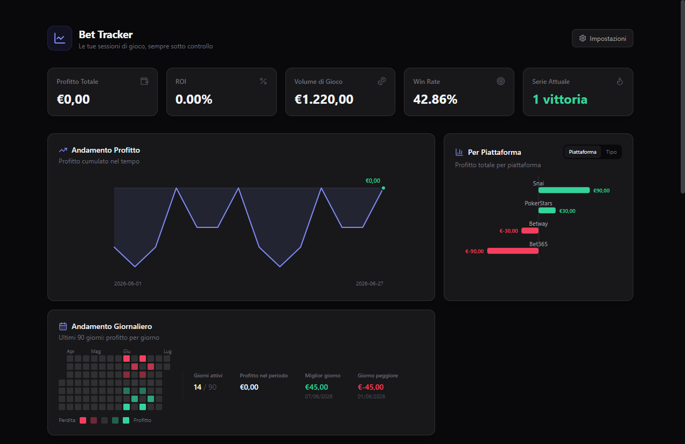

# Bet Tracker


App per tracciare le proprie sessioni di scommesse e gioco: dashboard con KPI, storico sessioni filtrabile, tutto salvato in locale. Disponibile come app desktop standalone (Windows e macOS) o come pagina web.



## Download

| Piattaforma | Release |
| --- | --- |
| Windows | [ultima release](https://github.com/Mynamesdsuper/bet-tracker/releases/latest) |
| macOS (Intel + Apple Silicon) | [ultima release (-mac)](https://github.com/Mynamesdsuper/bet-tracker/releases) |

## Funzionalità

- **Dashboard KPI** in tempo reale: Profitto Totale, ROI %, Volume di Gioco, Win Rate %, Serie Attuale (streak vittorie/sconfitte)
- **Grafici**: andamento del profitto cumulato nel tempo, profitto per piattaforma o per tipo di gioco (toggle), heatmap calendario degli ultimi 90 giorni — tutti con tooltip interattivi
- **Form di inserimento** rapido: data, piattaforma, tipo di gioco, deposito, cashout, note — con anteprima live del profitto/perdita
- **Tabella sessioni** filtrabile per piattaforma e tipo di gioco, ordinabile per data o profitto (ultimo filtro/ordinamento ricordato)
- **Eliminazione** di singole sessioni, con conferma disattivabile dalle impostazioni
- **Pannello Impostazioni**: tema chiaro/scuro, 4 colori d'accento selezionabili, budget mensile di deposito con banner di avviso, promemoria di backup periodico
- **Backup dati**: esportazione/importazione in formato JSON, esportazione CSV, reset completo dei dati
- **Persistenza locale**: nessun account, nessun server, nessun dato inviato altrove
- **Notifica di aggiornamento**: nella versione desktop, un banner discreto segnala quando è disponibile una nuova release (controllo passivo via API GitHub, al massimo una volta ogni 24h, sempre disattivabile)

## Come compilarla da sorgente

### App desktop (Windows)

```
npm install
npm run dist
```

Genera `release/Bet Tracker-win32-x64/Bet Tracker.exe`. Basta tenere l'intera cartella insieme (contiene le risorse necessarie a Electron) e avviare l'`.exe` — nessuna installazione richiesta, funziona offline.

Per testare in modalità sviluppo senza compilare l'eseguibile:

```
npm start
```

### Nel browser

In alternativa, `index.html` è una pagina autonoma che gira anche senza Electron:

```
start.bat
```

avvia un piccolo server locale e apre l'app nel browser predefinito. In questo caso i dati vengono salvati nel `localStorage` del browser (separato da quello dell'app desktop).

### App desktop (macOS)

I bundle `.app` di macOS contengono symlink interni (framework Electron) che Windows non può creare senza privilegi elevati — quindi `npm run dist:mac` **non funziona da Windows** in locale. La build va fatta su un runner macOS reale, cosa che il workflow di release gestisce automaticamente (vedi sotto).

L'app risultante non è firmata/notarizzata: al primo avvio macOS mostrerà un avviso Gatekeeper, sbloccabile con tasto destro → Apri.

## Come pubblicare una nuova release

Tutta la pipeline di release (bump versione, build Windows, build macOS, pubblicazione) è automatizzata in `.github/workflows/release.yml`. Per pubblicare una nuova versione, senza bisogno di compilare nulla in locale:

```
gh workflow run release.yml -f version=1.1.0 -f changelog="- Novità 1
- Novità 2
- Fix vari"
```

(oppure da GitHub → Actions → "Release" → Run workflow, inserendo numero di versione e changelog nei rispettivi campi)

Il workflow:
1. aggiorna `package.json`/`package-lock.json` alla nuova versione, crea il tag `vX.Y.Z` e lo pusha
2. builda in parallelo il pacchetto Windows (`windows-latest`) e quello macOS (`macos-latest`)
3. pubblica due release separate: `vX.Y.Z` (Windows) e `vX.Y.Z-mac` (macOS), ciascuna con il changelog nella descrizione e come file `CHANGELOG-vX.Y.Z.txt` allegato allo scaricamento (se il campo `changelog` viene omesso, si usa un testo di default che rimanda ai commit su GitHub)

## Struttura del progetto

```
index.html       # SPA: markup, stile (Tailwind) e logica (JS vanilla)
main.js          # processo principale Electron
preload.js       # espone in modo sicuro la versione dell'app al renderer (per la notifica di aggiornamento)
vendor/          # Tailwind CSS e Lucide Icons bundlati in locale (offline-first)
manifest.json    # manifest PWA (per l'uso come app installabile da browser)
sw.js            # service worker PWA (disattivato quando l'app gira in Electron)
icon.svg/icon.ico/icon.icns
scripts/make-icon.mjs      # rigenera icon.ico (Windows) a partire da icon.svg
scripts/make-icon-mac.mjs  # rigenera icon.icns (macOS) a partire da icon.svg
start.bat        # avvio rapido in modalità browser
.github/workflows/release.yml  # pipeline di release automatica (versioning + build Windows/macOS via CI)
docs/PROMPT_ORIGINALE.md  # specifica di partenza del progetto
```

## Stack tecnico

HTML/CSS/JS vanilla, Tailwind CSS, Lucide Icons, Electron + `@electron/packager` per il pacchetto desktop. Nessun framework, nessun bundler, nessuna dipendenza a runtime lato server.

## Dati

Ogni sessione è un record con: data, piattaforma, tipo di gioco, deposito, cashout, profitto (calcolato), note. Tutto resta sul dispositivo dell'utente — export/import JSON per backup manuale o migrazione tra dispositivi.
